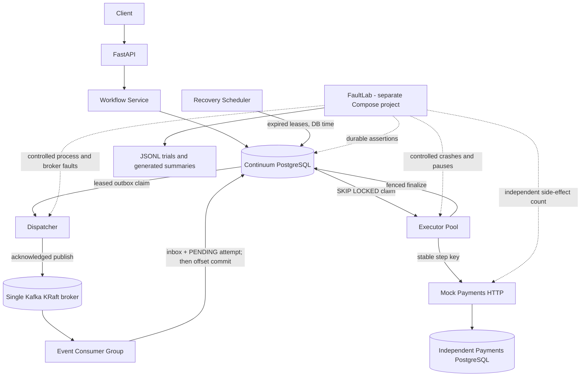

# Continuum — Durable Agent Runtime

A fault-tolerant execution runtime for long-running AI workflows.

**What happens when an AI agent completes an external action, but its worker dies before recording the result?** Continuum keeps workflow truth in PostgreSQL, transports readiness through at-least-once Kafka, and uses durable attempts, leases, fencing, and stable per-step idempotency keys to recover supported operations. FaultLab now injects repeated failures and checks durable workflow *and independent external-service state*. Continuum does **not** claim exactly-once distributed execution or safe automatic retries for arbitrary non-idempotent APIs.

## Implemented through Phase 4

- Sequential workflow/step/attempt state machines, PostgreSQL transactions, row locks, constraints, and transition audit
- FastAPI create/get/list/start/cancel/history API and read-only attempt diagnostics
- Transactional outbox, Kafka KRaft transport, versioned events, inbox dedupe, manual offset commits, and DLQ
- Separate event consumers, leased executors, heartbeats, database-time recovery, and fenced finalization
- Deterministic `noop`/`slow_noop` tools and an idempotency-key-backed `mock_refund` against an independent payments HTTP service/PostgreSQL
- FaultLab CLI, isolated Compose project, versioned fault scenarios, deterministic seeds, per-trial JSONL, derived reports, and an intentionally unsafe refund-retry comparison
- Expiring, fenced outbox publication claims: broker I/O no longer holds PostgreSQL row locks

There are no LLMs, real payments, arbitrary tool reconciliation, Redis, Kubernetes, or Kafka high-availability cluster.

## Architecture



Execution remains **reserve → commit → external execution without an open Continuum database transaction → fenced finalize → commit**. A crashed attempt expires; a replacement sends the same `continuum:<step_id>` key. Mock-payments returns the original refund for a matching repeated request. That is a demonstrated keyed operation contract, not a guarantee for all external APIs.

## Quick start

Requires Docker Compose and Python 3.12 with [uv](https://docs.astral.sh/uv/). All services use local images and development credentials. Main-stack PostgreSQL, Kafka, and mock-payments use named volumes.

```bash
uv sync
make up
curl http://localhost:8000/health/ready
curl http://localhost:8001/health/ready
```

Scale normal development workers/executors with `docker compose up --build -d --scale worker=3 --scale executor=3`. `make down` retains main-stack volumes; `make reset` **deletes** those volumes. Host ports default to API `8000`, mock-payments `8001`, Continuum PostgreSQL `55433`, payments PostgreSQL `55434`, and Kafka `19092`.

## API example

```bash
curl -sS -X POST http://localhost:8000/api/v1/workflows \
  -H 'content-type: application/json' \
  -d '{"workflow_type":"demo","steps":[{"name":"first","step_type":"noop"},{"name":"second","step_type":"noop"}]}'
curl -sS -X POST http://localhost:8000/api/v1/workflows/WORKFLOW_ID/start
curl -sS http://localhost:8000/api/v1/workflows/WORKFLOW_ID
curl -sS http://localhost:8000/api/v1/workflows/WORKFLOW_ID/attempts
curl -sS http://localhost:8000/api/v1/workflows/WORKFLOW_ID/history
```

`/start` returns after its PostgreSQL state/outbox transaction, not after asynchronous execution. Poll GET for `SUCCEEDED` or `FAILED`. The mock refund input is `{"customer_id":"customer-123","amount":"49.99"}`. The `slow_noop` input `{"duration_ms":1000}` and payment post-commit delay are deterministic local testing controls. FaultLab-only payment failure modes are rejected outside `APP_ENV=faultlab`.

## FaultLab

FaultLab starts a **separate** `continuum-faultlab` Compose project with its own volumes and host ports (`18000`, `18001`, `55435`, `55436`, `19093`). Its `clean` command removes only this exact project; it never resets normal development data. It executes real SIGKILL/pause/restart, Kafka/PostgreSQL stops, Kafka redelivery, and post-ack publisher crashes. The remaining database-time expiry and stale-token trials deliberately exercise concurrent PostgreSQL service calls. The unsafe refund baseline lives only in the harness.

```bash
uv run continuum-faultlab list
uv run continuum-faultlab run executor-crash-after-side-effect --runs 1 --seed 42
uv run continuum-faultlab campaign smoke --concurrency 2
uv run continuum-faultlab campaign reliability --concurrency 8
uv run continuum-faultlab report EXPERIMENT_ID
uv run continuum-faultlab clean
```

`run` and `campaign` build/start the isolated stack and clean its containers/volumes afterward by default. `--keep-stack` retains it for inspection; `--reuse-stack` uses an already running isolated stack. Raw `config.json`, `trials.jsonl`, `summary.json`, and `summary.md` go under ignored `artifacts/faultlab/<experiment-id>/`. `report` recalculates aggregates from raw trials. `report EXPERIMENT_ID --publish` creates curated `benchmarks/results/` files only if the trial revision matches the current **clean** Git revision. Git commit, dirty state, seed, counts, and environment are recorded; timing varies by machine.

The latest official campaign findings, when published, are in [the benchmark summary](benchmarks/results/phase4-summary.md) and [methodology](docs/FAULTLAB.md). These are local single-broker results, **not** production-scale reliability claims.

## Tests

```bash
make check
make test-unit
make test-kafka
```

`make check` runs Ruff format/lint, strict mypy, and the complete unit, API, PostgreSQL, real-Kafka, real-HTTP, and real-container FaultLab pytest suite with an 85% coverage floor. Its test target builds the **isolated** stack, migrates its separate test database, and cleans FaultLab volumes on exit. Focused Phase 1–3 targets remain in the Makefile. Runtime startup uses Alembic, never `metadata.create_all()`. The full reliability campaign is intentionally **not** part of routine CI.

## Planned

Phase 5 may add a local LLM provider and a durable agent loop only after the FaultLab evidence is reviewed. Arbitrary non-idempotent tool reconciliation, human approval, sandboxed coding agents, OpenTelemetry, Kubernetes, and broker HA remain unimplemented.

See [Architecture](docs/ARCHITECTURE.md), [Design Decisions](docs/DESIGN_DECISIONS.md), [Failure Model](docs/FAILURE_MODEL.md), and [FaultLab methodology](docs/FAULTLAB.md).
