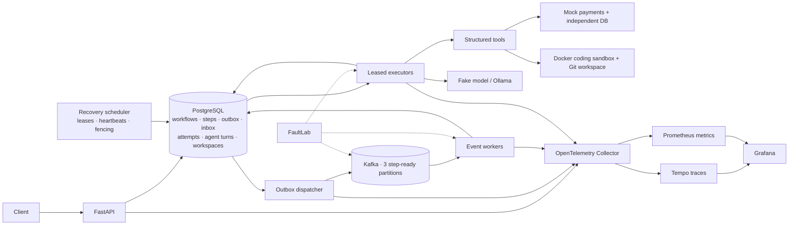

# Continuum — Durable Agent Runtime

Continuum is a fault-tolerant runtime for long-running AI agents that survives worker crashes, duplicate events, and uncertain external side effects by keeping execution state durable and reconciling work after failure.

**Measured local evidence:** In the [FaultLab campaign](benchmarks/results/phase4-summary.md), 5,075 Continuum trials included 2,875 injected failures; all 2,770 trials requiring recovery recovered, with zero duplicate or lost tested refunds. In the [final scaling benchmark](benchmarks/results/phase8-scaling.md), throughput rose from **2.516 to 11.805 workflows/s** between one and five executors on the same 180-workflow workload (three runs each). During a separate [300-workflow load test](benchmarks/results/phase8-load-failure.md), killing an executor that owned an active attempt led to one successful replacement, 300/300 workflow successes, and zero duplicate or lost tested refunds. These are measured local cohorts, not universal reliability guarantees.

## Architecture



**Why this exists:** An agent may apply a patch or issue a refund, then lose its worker before recording success. Retrying without evidence can repeat the effect; refusing to retry can strand the workflow. Continuum persists decisions and operation IDs before side effects, uses a transactional outbox and inbox around Kafka, claims attempts with leases and fencing, and reconciles supported effects after a crash. A completed workflow is backed by durable state; a trace helps explain it but is never required for correctness. See [Architecture](docs/ARCHITECTURE.md) and [Failure Model](docs/FAILURE_MODEL.md).

## Run it

Requires Docker Compose, Python 3.12, and [uv](https://docs.astral.sh/uv/). No paid API or Ollama model is needed for the primary demo.

```bash
git clone https://github.com/patelanush/Continuum.git
cd Continuum
uv sync
make up
make demo
make check
```

`make demo` runs a deterministic coding workflow through the real API, PostgreSQL, Kafka, and executor path. It kills the executor **after the patch is applied**, waits for lease recovery, verifies patch reconciliation and six passing tests, approves the local Git commit, and checks that exactly one patch and one commit resulted. It prints the workflow ID, attempt statuses, commit SHA, and a trace ID when observability is enabled. It normally finishes in a few minutes and never pushes the fixture repository. A [completed demo record](benchmarks/results/phase8-demo.json) captures the verified result.

To inspect traces and dashboards, start the optional local profile and rerun the demo:

```bash
make observability-up
make observability-check
make demo
```

Grafana: [localhost:3000](http://127.0.0.1:3000) (`admin` / `continuum-local`, development only); Prometheus: [localhost:9090](http://127.0.0.1:9090); Tempo: [localhost:3200](http://127.0.0.1:3200). `make observability-check` verifies a stored trace, Continuum metrics, provisioned datasources, and dashboard queries. `make down` retains development volumes; `make reset` deletes them. Observability is optional and workflow execution continues if its backends are unavailable.

## Results at a glance

The table uses one 250 ms `slow_noop` step per workflow, three event workers, 25 client requests in flight, 20 unmeasured warmups, and three 180-workflow repetitions per executor count. It includes API submission and full queue drain. Telemetry was off for throughput runs.

| Executors | Mean throughput | Mean median latency | Mean p95 latency | Speedup vs 1 |
|---:|---:|---:|---:|---:|
| 1 | 2.516 workflows/s | 35.05 s | 65.42 s | 1.00× |
| 3 | 7.321 workflows/s | 11.25 s | 20.85 s | 2.91× |
| 5 | 11.805 workflows/s | 6.41 s | 11.51 s | 4.69× |

Scaling remained useful through 12 executors (22.174 workflows/s on repeated 500-workflow runs). At 16, mean throughput fell to 8.641/s with ten recovered lease expirations under local resource pressure; API/outbox delay and host scheduling became limiting. Twelve was the best measured local setting, not a general cluster recommendation. [Method, per-run values, and bottleneck analysis](docs/PERFORMANCE.md).

The [mixed-agent benchmark](benchmarks/results/phase8-mixed.md) completed 100/100 workflows across normal, support-agent, refund, and coding paths, verifying 45 independent refunds and 15 local coding commits. The [load-failure benchmark](benchmarks/results/phase8-load-failure.md) completed 300/300 workflows after an active executor SIGKILL, with one recovered attempt and no duplicate/lost tested refunds. Recovery claim took 258.95 seconds under backlog, a measured limitation. The [70-span coding trace](benchmarks/results/phase7-trace-demo.json) links API start, Kafka publication/consumption, execution, model/tools, sandbox commands, approval, and Git commit.

## What is implemented

| Area | Components |
|---|---|
| Runtime | Python, FastAPI, PostgreSQL, async SQLAlchemy, Alembic, Kafka KRaft |
| Reliability | Transactional outbox/inbox, manual offsets, durable attempts, leases, heartbeats, fencing, reconciliation, DLQ |
| Agents | Persisted AgentRun/Turn/ModelCall/ToolCall, structured tools, deterministic FakeModelProvider, optional local Ollama |
| Coding | Persistent Git workspace, restricted Docker sandbox, recorded commands, patch/test/commit reconciliation, approval gate |
| Observability | OpenTelemetry, W3C context through outbox/Kafka, Tempo, Prometheus, four provisioned Grafana dashboards |
| Validation | pytest, Ruff, strict mypy, migrations, CI, FaultLab crash/replay campaigns |

Optional local-model demos are `make agent-demo-ollama` and `make coding-demo-ollama`; coding success with a compact local model is model-dependent. `make agent-demo-fake` and `make coding-demo-fake` are deterministic. The supported mock refund uses an idempotency key and an independent payments service; arbitrary non-idempotent APIs are outside that guarantee.

## Benchmark and test commands

```bash
make check
make faultlab-smoke
make faultlab-ai-smoke
make faultlab-coding-smoke
make benchmark-prepare
make benchmark-scaling EXECUTORS=1 WORKFLOWS=180 REPETITIONS=3
make benchmark-clean
```

The benchmark runner has separate `scaling`, `mixed`, and `failure-load` modes; prepare the isolated stack with matching replica counts before each. It writes raw records to ignored `artifacts/benchmarks/<experiment-id>/` and never resets the main development volumes. [Reproduction commands and interpretation](docs/PERFORMANCE.md), [FaultLab methodology](docs/FAULTLAB.md), [observability guide](docs/OBSERVABILITY.md), and [auditable resume facts](docs/RESUME_FACTS.md) provide detail. The full historical campaign is not run on every CI push.

## Limits

Continuum uses one local Kafka broker, so this is not broker HA or multi-region disaster recovery. Its Docker sandbox is restricted but not hardened hostile-code isolation; the local approval API has no production authentication. The proven external-effect contract applies to keyed mock refunds and reconciled coding operations, not arbitrary non-idempotent APIs. Ollama coding quality depends on the selected local model. Benchmarks are local-machine measurements; no cloud capacity claim follows from them. Git commits are local to the fixture workspace and no remote PR publication is implemented. See [sandbox security](docs/SANDBOX_SECURITY.md), [privacy policy](docs/OBSERVABILITY_PRIVACY.md), [candidate SLOs](docs/SLOS.md), and [design decisions](docs/DESIGN_DECISIONS.md).
