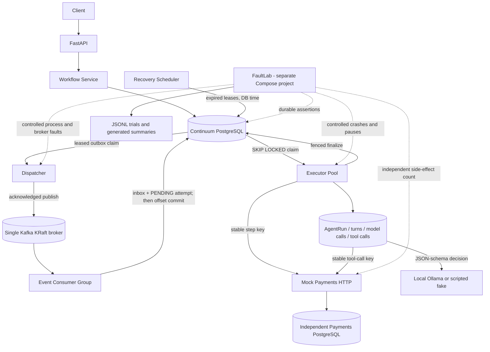

# Continuum — Durable Agent Runtime

A fault-tolerant execution runtime for long-running AI workflows.

**What happens when an AI agent completes an external action, but its worker dies before recording the result?** Continuum keeps workflow truth in PostgreSQL, transports readiness through at-least-once Kafka, and uses durable attempts, leases, fencing, and stable operation keys to recover supported operations. Phase 5 also persists model decisions and tool-call identities so an agent resumes accepted reasoning instead of starting over. FaultLab injects repeated failures and checks durable workflow *and independent external-service state*. Continuum does **not** claim exactly-once model inference, distributed execution, or safe automatic retries for arbitrary non-idempotent APIs.

## Implemented through Phase 5

- Sequential workflow/step/attempt state machines, PostgreSQL transactions, row locks, constraints, and transition audit
- FastAPI create/get/list/start/cancel/history API and read-only attempt diagnostics
- Transactional outbox, Kafka KRaft transport, versioned events, inbox dedupe, manual offset commits, and DLQ
- Separate event consumers, leased executors, heartbeats, database-time recovery, and fenced finalization
- Deterministic `noop`/`slow_noop` tools and an idempotency-key-backed `mock_refund` against an independent payments HTTP service/PostgreSQL
- FaultLab CLI, isolated Compose project, versioned fault scenarios, deterministic seeds, per-trial JSONL, derived reports, and an intentionally unsafe refund-retry comparison
- Expiring, fenced outbox publication claims: broker I/O no longer holds PostgreSQL row locks
- One durable `support_agent` step with AgentRun, numbered turns, model-call audit/retries, accepted decisions, and one structured tool action per turn
- Deterministic FakeModelProvider for tests/FaultLab and a real local Ollama JSON-schema provider; no paid model API dependency
- Allowlisted read-only refund-policy tool and keyed mock-refund tool with durable per-tool-call operation identity, context reconstruction, and replay-safe agent recovery
- Read-only `/agent` trajectory diagnostics and eight Phase 5 AI FaultLab scenarios

There are no paid model providers, real payments, arbitrary tool reconciliation, Redis, Kubernetes, or Kafka high-availability cluster.

## Architecture



Execution remains **reserve → commit → external execution without an open Continuum database transaction → fenced finalize → commit**. A crashed attempt expires; a replacement sends the same `continuum:<step_id>` key. Mock-payments returns the original refund for a matching repeated request. That is a demonstrated keyed operation contract, not a guarantee for all external APIs.

For `support_agent`, the outer execution attempt also persists each accepted model decision **before** executing its allowlisted tool. The refund key is `continuum:agent-tool:<tool_call_id>`, stable across replacement attempts. A model response lost before its decision commit may be inferred again and differ; a committed decision is replayed. See [Durable agents](docs/AGENTS.md).

## Quick start

Requires Docker Compose and Python 3.12 with [uv](https://docs.astral.sh/uv/). All services use local images and development credentials. Main-stack PostgreSQL, Kafka, and mock-payments use named volumes.

```bash
uv sync
make up
curl http://localhost:8000/health/ready
curl http://localhost:8001/health/ready
```

Scale normal development workers/executors with `docker compose up --build -d --scale worker=3 --scale executor=3`. `make down` retains main-stack volumes; `make reset` **deletes** those volumes. Host ports default to API `8000`, mock-payments `8001`, Continuum PostgreSQL `55433`, payments PostgreSQL `55434`, and Kafka `19092`.

For a local model, install/start Ollama separately and pull a compact model (the validated local smoke used `qwen2.5:3b`). Docker executors default to `http://host.docker.internal:11434`; override `OLLAMA_BASE_URL` and `OLLAMA_MODEL` as needed. `make agent-demo-fake` works without Ollama; `make agent-demo-ollama` uses the real local model. Model weights are not stored in this repository or downloaded in CI.

## API example

```bash
curl -sS -X POST http://localhost:8000/api/v1/workflows \
  -H 'content-type: application/json' \
  -d '{"workflow_type":"demo","steps":[{"name":"first","step_type":"noop"},{"name":"second","step_type":"noop"}]}'
curl -sS -X POST http://localhost:8000/api/v1/workflows/WORKFLOW_ID/start
curl -sS http://localhost:8000/api/v1/workflows/WORKFLOW_ID
curl -sS http://localhost:8000/api/v1/workflows/WORKFLOW_ID/attempts
curl -sS http://localhost:8000/api/v1/workflows/WORKFLOW_ID/history
curl -sS http://localhost:8000/api/v1/workflows/WORKFLOW_ID/agent
```

`/start` returns after its PostgreSQL state/outbox transaction, not after asynchronous execution. Poll GET for `SUCCEEDED` or `FAILED`. The mock refund input is `{"customer_id":"customer-123","amount":"49.99"}`. The `slow_noop` input `{"duration_ms":1000}` and payment post-commit delay are deterministic local testing controls. FaultLab-only payment failure modes are rejected outside `APP_ENV=faultlab`.

Support-agent workflow example (asynchronous; poll GET and then inspect `/agent`):

```bash
curl -sS -X POST http://localhost:8000/api/v1/workflows \
  -H 'content-type: application/json' \
  -d '{"workflow_type":"support-demo","steps":[{"name":"resolve-refund","step_type":"support_agent","input":{"customer_id":"customer-123","amount":"49.99","request":"I was charged twice. Please refund the duplicate charge."}}]}'
make agent-demo-fake
# If local Ollama is available:
make agent-demo-ollama
```

The demo scripts create/start a unique workflow, poll with a timeout, display its trajectory, and independently verify one mock refund. Fake-provider scripts and post-commit delay controls are for local tests/FaultLab, not arbitrary model-selected execution.

## FaultLab

FaultLab starts a **separate** `continuum-faultlab` Compose project with its own volumes and host ports (`18000`, `18001`, `55435`, `55436`, `19093`). Its `clean` command removes only this exact project; it never resets normal development data. It executes real SIGKILL/pause/restart, Kafka/PostgreSQL stops, Kafka redelivery, and post-ack publisher crashes. The remaining database-time expiry and stale-token trials deliberately exercise concurrent PostgreSQL service calls. The unsafe refund baseline lives only in the harness.

```bash
uv run continuum-faultlab list
uv run continuum-faultlab run executor-crash-after-side-effect --runs 1 --seed 42
uv run continuum-faultlab campaign smoke --concurrency 2
uv run continuum-faultlab campaign reliability --concurrency 8
uv run continuum-faultlab report EXPERIMENT_ID
uv run continuum-faultlab clean
```

`run` and `campaign` build/start the isolated stack and clean its containers/volumes afterward by default. `--keep-stack` retains it for inspection; `--reuse-stack` uses an already running isolated stack. Raw `config.json`, `trials.jsonl`, `summary.json`, and `summary.md` go under ignored `artifacts/faultlab/<experiment-id>/`. `report` recalculates aggregates from raw trials. `report EXPERIMENT_ID --publish` creates curated `benchmarks/results/` files only if the trial revision matches the current **clean** Git revision. Git commit, dirty state, seed, counts, and environment are recorded; timing varies by machine.

Phase 5 adds `continuum-faultlab campaign ai-smoke` for model timeout, malformed output, persisted-decision crash, post-refund SIGKILL, persisted-tool-result crash, final-answer crash, turn-limit, and unknown-tool handling. Its results are reported **separately** from the official Phase 4 campaign below.

The clean-revision [official campaign](benchmarks/results/phase4-summary.md) recorded **5,175 trials**: 5,075 Continuum trials (2,875 with injected faults) were classified correct, including 510 workflows expecting a refund with **zero duplicate or lost refunds**. The 100 separate, intentionally unsafe retry controls produced 100 duplicate refunds. Recovery-to-success was 2,770/2,770 where required; 100 persistent pre-commit timeout workflows correctly ended `FAILED` with no refund. Replacement-attempt recovery had a measured p95 of **5,330.51 ms** across 547 samples with a five-second test lease. See the [methodology and denominators](docs/FAULTLAB.md). These are local single-broker observations, **not** production-scale reliability guarantees.

## Tests

```bash
make check
make test-unit
make test-kafka
```

`make check` runs Ruff format/lint, strict mypy, and the complete unit, API, PostgreSQL, real-Kafka, real-HTTP, agent, and real-container FaultLab pytest suite with an 85% coverage floor. Its test target builds the **isolated** stack, migrates its separate test database, and cleans FaultLab volumes on exit. The optional real-Ollama test is marked `ollama` and excluded from normal CI. Runtime startup uses Alembic, never `metadata.create_all()`. The full reliability campaign is intentionally **not** part of routine CI.

## Planned

Phase 6 may add a sandboxed coding-agent demonstration. Arbitrary non-idempotent tool reconciliation, human approval, filesystem-effect recovery, OpenTelemetry, Kubernetes, and broker HA remain unimplemented.

See [Architecture](docs/ARCHITECTURE.md), [Durable agents](docs/AGENTS.md), [Design Decisions](docs/DESIGN_DECISIONS.md), [Failure Model](docs/FAILURE_MODEL.md), and [FaultLab methodology](docs/FAULTLAB.md).
